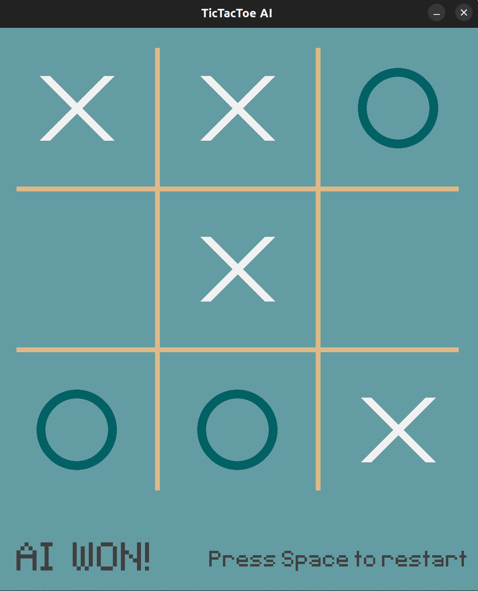
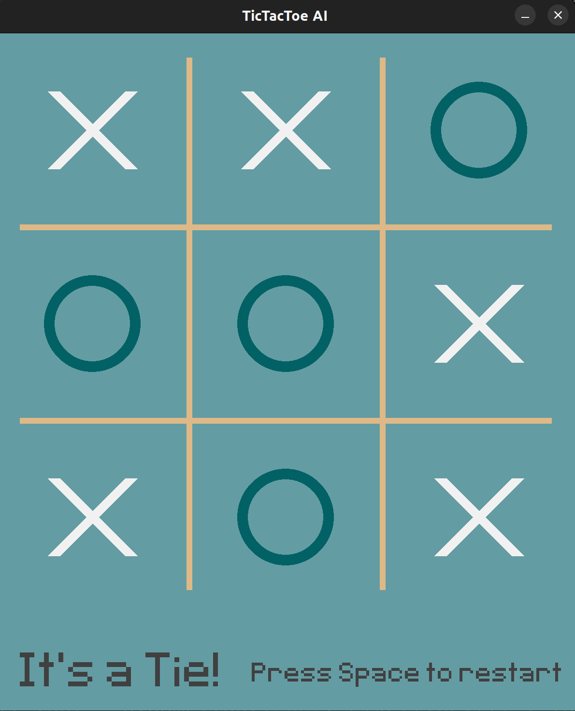

# TicTacToe AI

A TicTacToe game where you play against an AI   

The AI is built using the Minimax algorithm, you can learn more about it [here](https://www.youtube.com/watch?v=l-hh51ncgDI)


Also, you can see it in action [here](https://www.youtube.com/watch?v=rCkwOVDNoks)

## Screenshots




## Installation 


Check that you have Python installed using the following command

```bash
python3 --version
```
If you don't have Python installed then 

### Linux (Ubuntu)
```bash
sudo apt update
sudo apt install python3
```
### Windows 
use the [Official Python Website](https://www.python.org/downloads/windows/) 

### Then install Pygame

### Linux
```bash
python3 -m pip install -U pygame --user
```
### Windows
```bash
pip install pygame
```

## Usage
Clone the repo then run tictactoe.py   

Play against the AI.    

P.S: you can never win ;)
